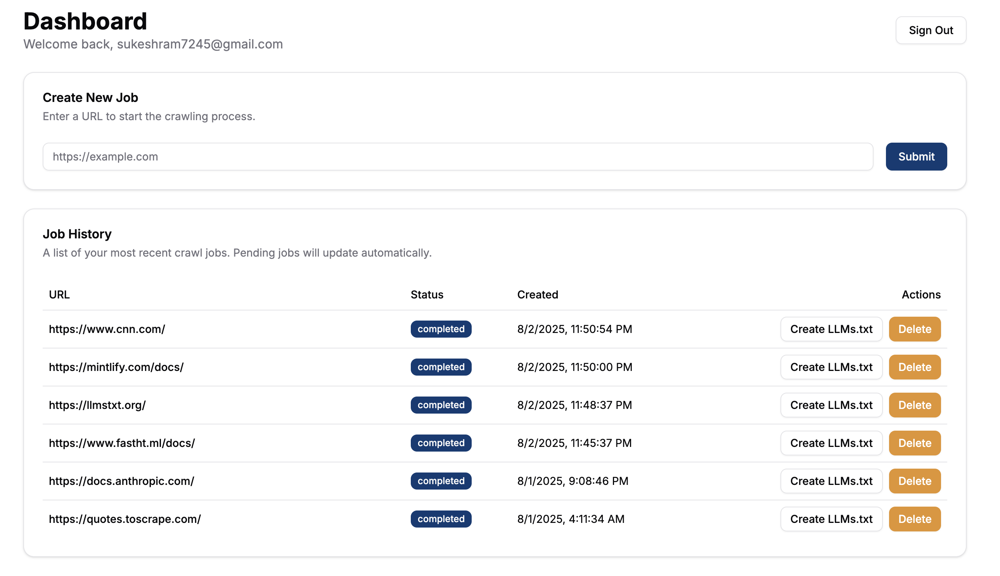
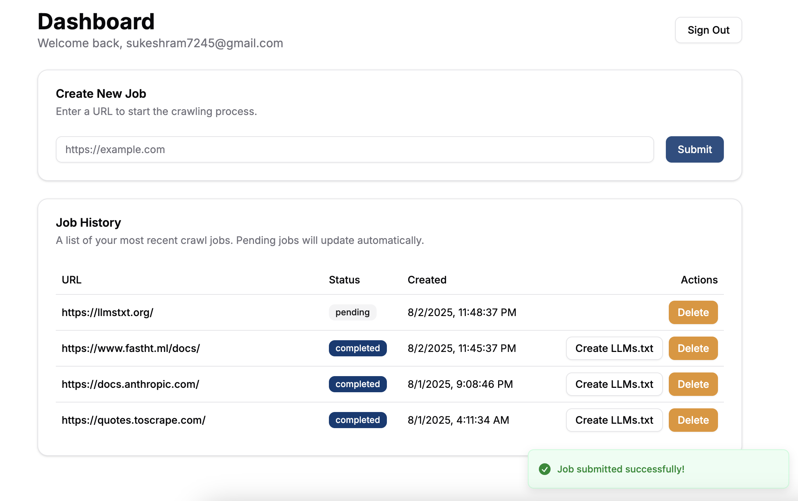
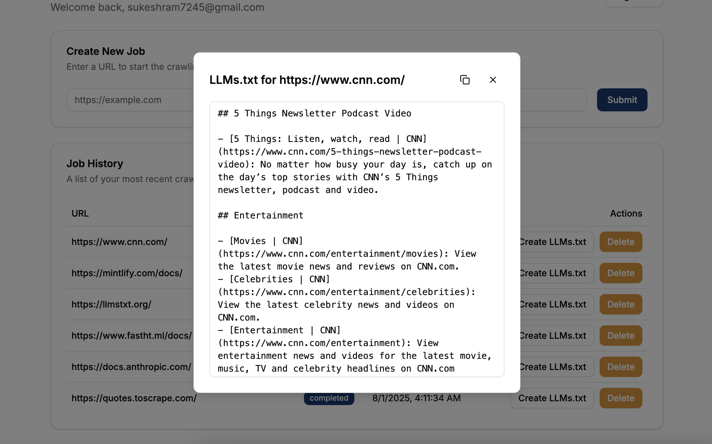
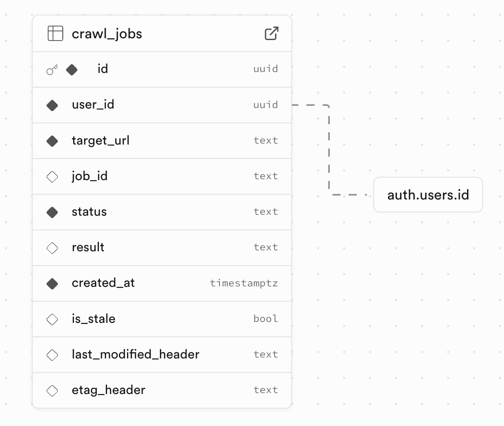
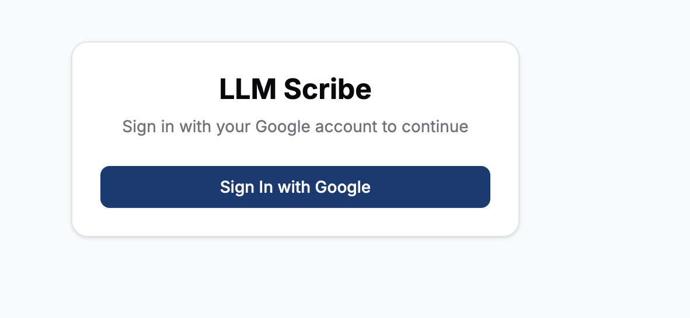

# LLM Scribe

**Intelligent Web Content Monitoring & LLMs.txt Generation Platform**

> **Transform any website into structured LLMs.txt content with intelligent change detection and automated monitoring.**

## 🎯 **What is LLM Scribe?**

LLM Scribe is a production-ready web application that automatically crawls websites, generates LLMs.txt content, and intelligently monitors for content changes. Built for teams that need reliable, scalable web content processing with enterprise-grade security and real-time monitoring.

**🔗 [Try it live now](https://llm-scribe.vercel.app/)**

---

## 🚀 **Core Capabilities**

### **1. Intelligent Web Crawling**
- **Non-blocking job submission** - Submit URLs and get instant feedback
- **Real-time status tracking** - Watch jobs progress from pending → completed/failed
- **Automatic content extraction** - Generate LLMs.txt content from any website
- **Optimistic UI updates** - Seamless user experience with instant visual feedback

### **2. Smart Content Change Detection**
- **HTTP header monitoring** - Uses ETag and Last-Modified headers for efficient detection
- **Automated cron jobs** - Runs every 6 hours to detect content changes
- **Stale content management** - Automatically flags outdated content for re-crawling
- **Rate-limited requests** - Respectful to target servers with built-in delays

### **3. Enterprise Security & Compliance**
- **Google OAuth 2.0 authentication** - Secure, enterprise-grade login
- **Row Level Security (RLS)** - Database-level isolation ensuring users only access their data
- **Server-side validation** - All inputs validated on the server
- **Secure API endpoints** - Bearer token authentication for automated processes

### **4. Production-Ready Architecture**
- **Server Actions** - Secure, server-side logic with client-side calling
- **Real-time polling** - Automatic status updates without page refreshes
- **Error handling** - Comprehensive error management with user-friendly messages
- **Scalable design** - Built to handle multiple concurrent users and jobs

---

## 🎨 **User Experience**

### **Dashboard Overview**
- **Clean, modern interface** built with Tailwind CSS and ShadCN/UI
- **Responsive design** - Works perfectly on desktop and mobile
- **Real-time updates** - See job status changes as they happen
- **One-click operations** - Copy LLMs.txt content to clipboard instantly

*Modern, responsive dashboard with real-time job tracking and status updates*

### **Job Management**
- **Create jobs** - Submit any URL for processing
- **Track progress** - Real-time status updates with visual indicators
- **Manage history** - View your 8 most recent jobs with full details
- **Handle failures** - Retry failed jobs with a single click

*Real-time job status tracking with optimistic UI updates and progress indicators*

### **Content Generation**
- **LLMs.txt creation** - Generate structured content from any website
- **Preview functionality** - View content before copying
- **Copy to clipboard** - One-click content extraction
- **Stale content detection** - Automatic re-crawling when content changes

*One-click LLMs.txt content generation with copy-to-clipboard functionality*

---

## 🏗️ **Technical Architecture**

### **Modern Tech Stack**
- **Frontend**: Next.js 15 + React 19 + TypeScript
- **Styling**: Tailwind CSS + ShadCN/UI components
- **Backend**: Next.js Server Actions + Supabase
- **Database**: PostgreSQL with Row Level Security
- **Authentication**: Supabase Auth with Google OAuth
- **Deployment**: Vercel with automatic CI/CD

### **Custom-Built Crawling API**
LLM Scribe leverages a **production-ready microservice** specifically built for this project:

- **Dedicated Crawling Engine**: [Python Web Crawler API](https://github.com/SUKESH127-art/python_web_crawler) - A stateless, asynchronous microservice
- **Live Production API**: [https://llms-txt-crawler-api.onrender.com](https://llms-txt-crawler-api.onrender.com)
- **Technology**: FastAPI + Firecrawl + Docker + CircleCI
- **Architecture**: Stateless design with horizontal scaling capabilities

#### **Key API Features:**
- **Asynchronous Job Processing**: Non-blocking crawl operations with real-time status polling
- **Intelligent Content Structuring**: Automatically groups pages by URL path and applies language filtering
- **Production Security**: API key authentication, input validation, and secure error handling
- **Enterprise Scalability**: Stateless design enables horizontal scaling across multiple instances
- **CI/CD Pipeline**: Automated deployment with CircleCI and Docker Hub integration

### **Database Architecture**
Our robust database design ensures data security and scalability:

*Comprehensive database schema with Row Level Security (RLS) ensuring data isolation and security*

### **Authentication System**
Secure, enterprise-grade authentication flow:

*Secure Google OAuth 2.0 integration providing enterprise-grade authentication*

### **Key Design Patterns**
- **Server Actions** - Secure backend operations
- **Optimistic Updates** - Instant UI feedback
- **Real-time Polling** - Automatic status synchronization
- **Content Change Detection** - HTTP header-based monitoring
- **Stale Job Management** - Intelligent re-crawling system

### **Frontend-API Integration**
The application seamlessly integrates with the custom crawling API:

- **Job Submission**: Frontend submits URLs to the Python API via Next.js Server Actions
- **Status Polling**: Real-time job status updates through the `/crawl-status/{job_id}` endpoint
- **Content Retrieval**: Generated LLMs.txt content fetched and displayed in the UI
- **Error Handling**: Comprehensive error management across both frontend and API layers
- **Security**: API key authentication ensures secure communication between services

---

## 📊 **Performance & Scalability**

### **Efficient Processing**
- **Non-blocking operations** - Jobs don't block the UI
- **Optimistic updates** - Instant visual feedback
- **Real-time polling** - Automatic status synchronization
- **Batch processing** - Efficient database operations

### **Resource Management**
- **Automatic job culling** - Keeps only 8 most recent jobs per user
- **Rate limiting** - Respectful to target servers
- **Timeout protection** - Prevents hanging requests
- **Error recovery** - Robust error handling and recovery

---

## 🔒 **Security & Compliance**

### **Data Protection**
- **Row Level Security (RLS)** - Database-level data isolation
- **User authentication** - Secure Google OAuth 2.0 flow
- **Input validation** - Server-side validation for all inputs
- **Secure API endpoints** - Bearer token authentication

### **Privacy & Compliance**
- **User data isolation** - Users can only access their own data
- **Secure session management** - Proper session handling and cleanup
- **Audit trails** - Complete job history and status tracking
- **GDPR ready** - User data control and deletion capabilities

## 🔧 **Integration & API**

### **RESTful API**
- **Job management endpoints** - Create, read, update, delete jobs
- **Status checking** - Real-time job status updates
- **Content retrieval** - Get generated LLMs.txt content
- **Authentication** - Secure API access with OAuth tokens

### **Notifications Support**
- **Job completion notifications** - Get notified when jobs complete
- **Content change alerts** - Receive alerts when content changes
- **Error notifications** - Get notified of processing errors
- **Custom integrations** - Connect with your existing workflows

---

## 🤖 **Automated Monitoring & Change Detection**

### **Cron-Based Automation**
LLM Scribe implements a sophisticated automated monitoring system that **effectively detects changes and refreshes LLMs.txt files without manual intervention**:

- **Scheduled Monitoring**: Automated cron jobs run every 6 hours to check for content changes
- **HTTP Header Analysis**: Uses ETag and Last-Modified headers for efficient change detection
- **Intelligent Refresh Logic**: Automatically triggers new crawls when content is detected as stale
- **Zero Manual Intervention**: Complete automation ensures content stays current without user action

### **Change Detection Technology**
The system employs advanced techniques to detect content changes:

- **ETag Validation**: Checks for entity tags to identify content modifications
- **Last-Modified Headers**: Monitors timestamp changes on target websites
- **Stale Content Flagging**: Automatically marks jobs as stale when changes are detected
- **Smart Re-crawling**: Only refreshes content when actual changes are confirmed

### **Automation Workflow**
1. **Scheduled Execution**: Cron jobs trigger every 6 hours automatically
2. **Content Analysis**: System checks ETag and Last-Modified headers for each job
3. **Change Detection**: Compares current headers with stored values
4. **Automatic Refresh**: Initiates new crawl jobs for stale content
5. **Status Updates**: Updates job status and flags content as fresh

### **Production Deployment**
- **Vercel Cron Jobs**: Leverages Vercel's built-in cron functionality for reliable scheduling
- **Serverless Execution**: Runs on Vercel's edge network for global performance
- **Error Handling**: Comprehensive error management with automatic retry logic
- **Monitoring**: Built-in logging and status tracking for all automated operations

---

*Built with ❤️ using Next.js 15, React 19, Supabase, and FastAPI*
